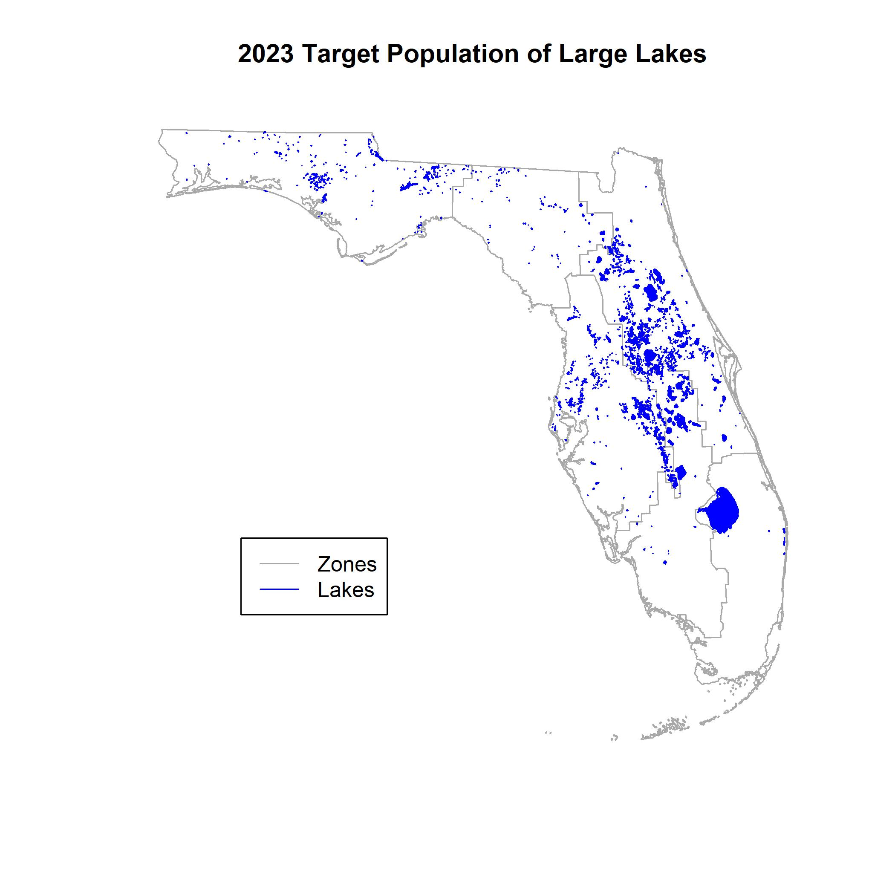
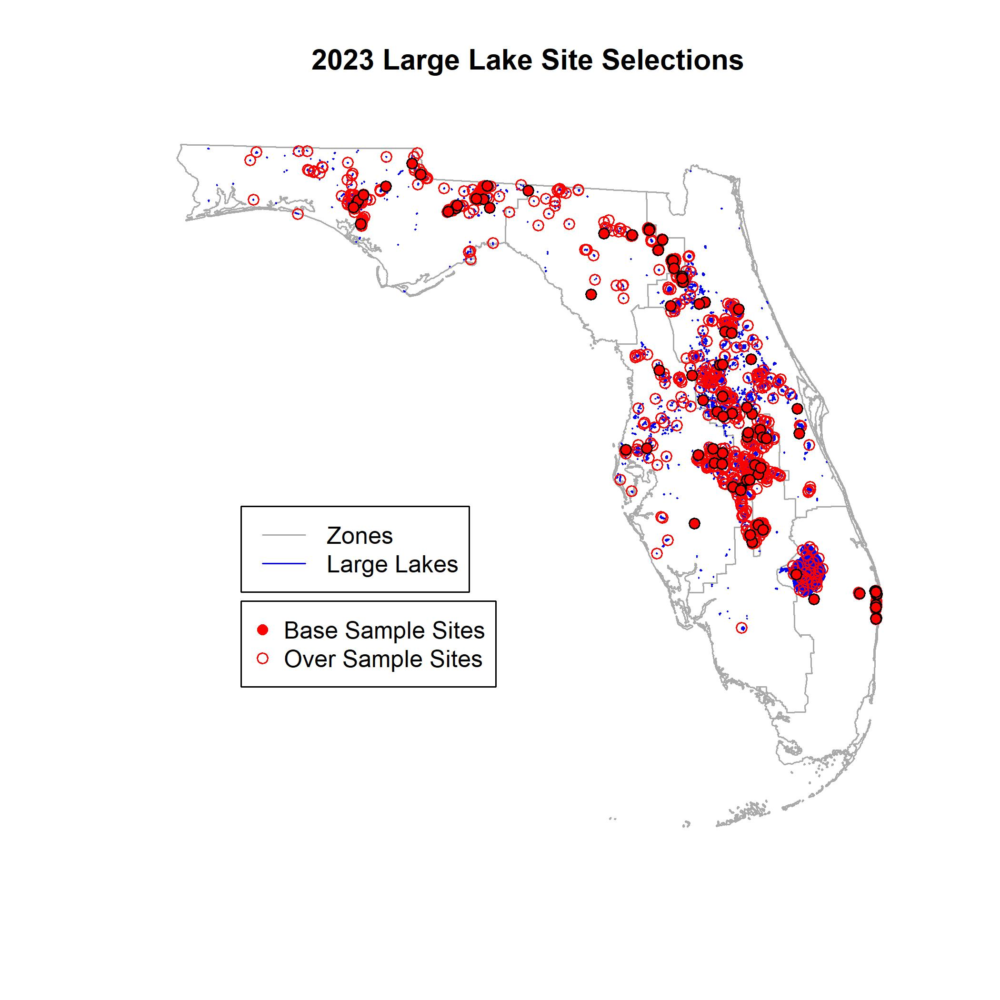

```{r setup, include=FALSE}
knitr::opts_chunk$set(echo = TRUE)
```

## Contacts:
### Data Analyst
__Vacant Position__  
Environmental Consultant  
Florida Department of Environmental Protection (FDEP)  
Division of Environmental Assessment and Restoration (DEAR)  
Watershed Monitoring Section (WMS)  


### Section Administrator
__Jay Silvanima__  
Environmental Administrator  
Florida Department of Environmental Protection (FDEP)  
Division of Environmental Assessment and Restoration (DEAR)  
Watershed Monitoring Section (WMS)  
2600 Blair Stone Road  
Mail Station 3560  
Tallahassee, Florida 32399-2400  
James.Silvanima@FloridaDEP.gov   
phone: 850-245-8507  
fax: 850-245-8554  

### Analysis and Reporting Coordinator
__Stephanie Sunderman-Barnes__  
Environmental Consultant  
Florida Department of Environmental Protection (FDEP)  
Division of Environmental Assessment and Restoration (DEAR)  
Watershed Monitoring Section (WMS)  
2600 Blair Stone Road  
Mail Station 3560  
Tallahassee, Florida 32399-2400  
Stephanie.Sundermanbarnes@FloridaDEP.gov  
850-245-8517  

## __Description of Sample Design for Panel Design__
Target population: All lakes in Florida that are greater than or equal to 10.0 hectares. Defined by FDEP based on the 2007 24K NHD water body GIS coverage. This identifies 1,699 large lakes.

### __Sample Frame:__ 
The frame was provided by Florida Department of Environmental Protection, named _‘Cycle17_LargeLakes_coverage_2023.shp’_. The GIS coverage is a large lake polygon coverage provided by FDEP based on the 2007 24K NHD water body data. GIS Data:

Attributes include: GNIS_NAME, REACHCODE, HECTARES, REPUNIT,  RESOURCE, Comments, LakeCode, Shape_Leng, Shape_Area, Geometry

The state of Florida is divided into six regions (reporting units) for sampling design. The reporting unit name attribute in Cycle17_LargeLakes_2023_coverage.shp is REPUNIT and the six values are: ZONE 1, ZONE 2, ZONE 3, ZONE 4, ZONE 5, ZONE 6.

#### __Survey Design for Cycle 17 Large Lake Site Selections:__

Purpose of this R script is to select large lake sites throughout the 6 reporting units as part of an annual water quality sample survey of Florida large lakes.   

---
# Code updated 01/06/2023 so it may be run in spsurvey 5.4.0 by Jay Silvanima. 
# This is the first set of site selections performed using spsurvey version 5.3.0 and an unequal probability sample.  
---
Code developed using R version 4.1.2 and spsurvey version 5.4.0.  

***  
Load the libraries that will be called in this script.
```{r warning=FALSE, message=FALSE}
library (spsurvey)
library(dplyr)
```

Check working directory and change location if needed.
```{r }
getwd()
```
```{r include = FALSE}
#"C:/R/2023 Large Lake Selections"
```
Create two simple features objects from shapefiles.  
1) Polygon features representing the 2023 target population of large lakes (Cycle17_LargeLakes_coverage_2023).  
2) Polygon features representing the Zones (Watershed_Monitoring_Section_(WMS)_Cycle_3_Reporting_Units).  
Change all projections to Florida Albers HARN(CRS code 3087).

Calculate lake area per reporting Zone.
```{r warning=FALSE, message=FALSE}
dsgn_ll <- st_read(dsn=".",layer="Cycle17_LargeLakes_coverage_2023")
wms_c3_reporting_units <- st_read(dsn=".",layer="Watershed_Monitoring_Section_(WMS)_Cycle_3_Reporting_Units")
wms_c3_reporting_units <- st_transform(wms_c3_reporting_units, crs = 3087)
wms_c3_reporting_units

```

For large lakes target population: Convert all column names to lowercase. Inspect data.  
```{r }
names(dsgn_ll)<-tolower(names(dsgn_ll))
names(dsgn_ll)
head(dsgn_ll)
tail(dsgn_ll)
```

Calculate Lake polygon areas per c3_zone for all zones.  
```{r }
lakearea<-tapply(dsgn_ll$hectares,list(dsgn_ll$repunit), sum)
lakearea[is.na(lakearea)] <- 0
round(addmargins(lakearea),1)

```

Plot the Zone polygons and 2023 target population of large lakes polygons.  
```{r results='hide'}
jpeg('2023_LL_Population.jpg', units = 'in', width = 7, height = 7, res = 300)
plot(st_geometry(wms_c3_reporting_units), border='darkgray', main= '2023 Target Population of Large Lakes')
plot(st_geometry(dsgn_ll), border = 'blue', col = 'blue', add = TRUE)
legend(150000, 300000, legend=c('Zones','Lakes'), col=c('darkgray','blue'),lty=c(1,1))
dev.off()

```
```{r echo=FALSE}

```
Create a factor column to use as a stratum variable and check the components in the stratum column.

```{r }
dsgn_ll$stratum<-factor(as.character(dsgn_ll$repunit))
levels(dsgn_ll$stratum)
head(dsgn_ll)
```

Create lake area categories for each stratum (Zone).

First create column area_cat

```{r }
dsgn_ll$area_cat <- rep(NA,nrow(dsgn_ll))
dsgn_ll$area_cat <- dsgn_ll$hectares
abbr <- c("Zone 1","Zone 2", "Zone 3", "Zone 4", "Zone 5", "Zone 6")
names(abbr) <- levels(dsgn_ll$stratum)
```
Unequal probability of selection within each strata based on lake area. Within each stratum lakes are ordered from smallest to largest area. Then the cumulative sum of lake area is computed, split into five equal area parts, and the lake identified at the boundary of the parts. The area of those five lakes is used to identify the lake area categories for the unequal probability sampling. For example using large lakes, the Suwannee region has 89 large lakes with a total lake area of 7632.871 ha.  The five cumulative area breaks are 48 ha, 222 ha, 467 ha, 805 ha, and 1630+ ha. The area categories for the Suwannee are [10,49], (49,215], (215,467], (467,805], and (805,1.63e+03]. The number of lakes in each area category is 68, 14, 4, 2, and 1. The total lake area in each area category is 1484.778 ha, 1545.794 ha, 1406.269 ha, 1534.205 ha, and 1633.170 ha, respectively.

The below loop creates five lake categories based on size per reporting unit and populates the area_cat column with this information.   

It also exports out a .csv file of the 30 area categories (five per zone).

```{r }
for(i in levels(dsgn_ll$stratum) ) {
  tst <- dsgn_ll$stratum == i
  itmp <- order(dsgn_ll$hectares[tst])
  tmp <- cumsum(sort(dsgn_ll$hectares[tst]))
  n <- length(itmp)
  if(i != "Zone 6")   # Special case for Lake Okeechobee
  {ctmp <- cut(tmp, 
               breaks=c(seq(10, tmp[n], length=6)),
               include.lowest = TRUE)
  }
  else
  {ctmp <- cut(tmp, 
               breaks=c(seq(10, tmp[n-1], length=5), tmp[n]),
               include.lowest = TRUE)
  }
  icut <- cumsum(table(ctmp))
  acut <- unique(ceiling(dsgn_ll$hectares[tst][itmp][icut]))
  dsgn_ll$area_cat[tst] <- 
    paste(abbr[i],(cut(dsgn_ll$hectares[tst], breaks=c(10,acut),
                       include.lowest=TRUE)), sep="_")
}
dsgn_ll$area_cat <- factor(dsgn_ll$area_cat)


area_cat <-levels(dsgn_ll$area_cat)
area_cat <-as.data.frame(area_cat)

write.csv(area_cat, "area_cat.csv")
```
Create dataframe of lake category, lake numbers, and size.

rename columns to 'Zones', 'Number of Lakes, and 'hectares' and remove row names.

Write out dataframe frame to .csv file.  

```{r }
Lakeareas <- data.frame(addmargins(table(dsgn_ll$repunit)),round(addmargins(lakearea),1))
names(Lakeareas) <-c("Zones", "Number_of_Lakes", "hectares") 
row.names(Lakeareas)<- NULL
Lakeareas
write.csv(Lakeareas, "2023 Large Lake Framesize.csv", row.names = FALSE)
```

Create lake size category data frame, rename columns to 'area_cat' and ‘Number_of_Lakes’ and remove row names.  
Write out data frame to .csv file. 

```{r }
area_cat_summary <- data.frame(table(dsgn_ll$area_cat))
names(area_cat_summary) <- c('area_cat','Number_of_Lakes')
area_cat_summary
write.csv(area_cat_summary, "2023 Large Lake Size Categories.csv", row.names = FALSE)
```

A Generalized Random Tessellation Stratified (GRTS) survey design for an areal lake resource was used.  The GRTS design includes reverse hierarchical ordering of the selected sites.

***
Create the stratification to be used.

Create the list of lake size categories to by used.
```{r}
LL_base <-c("Zone 1"=15,"Zone 2"=15,"Zone 3"=15, "Zone 4"=15, "Zone 5"=15, "Zone 6"=15)
LL_over <-c("Zone 1"=135,"Zone 2"=135,"Zone 3"=135, "Zone 4"=135, "Zone 5"=135, "Zone 6"=135)
LL_select <-c("Zone 1"="unequal","Zone 2"="unequal","Zone 3"="unequal", "Zone 4"="unequal", "Zone 5"="unequal", "Zone 6"="unequal")

LL_catyn <-list("Zone 1" = c('Zone 1_(1.02e+03,1.43e+03]' = 3,
                          'Zone 1_(1.43e+03,3.27e+03]' = 3,
                          'Zone 1_(144,1.02e+03]' = 3,
                          'Zone 1_(45,144]' = 3,
                          'Zone 1_[10,45]' = 3),
                        "Zone 2" = c('Zone 2_(215,467]' = 3,
                          'Zone 2_(467,805]' = 3,
                          'Zone 2_(49,215]' = 3,
                          'Zone 2_(805,1.59e+03]' = 3,
                          'Zone 2_[10,49]' = 3), 
                        "Zone 3" = c('Zone 3_(1.78e+03,3.26e+03]' = 3,
                          'Zone 3_(182,1.78e+03]' = 3,
                          'Zone 3_(3.26e+03,7.44e+03]' = 3,
                          'Zone 3_(7.44e+03,1.76e+04]' = 3,
                          'Zone 3_[10,182]' = 3),
                        "Zone 4" = c('Zone 4_(1.32e+03,1.86e+03]' = 3,
                          'Zone 4_(175,429]' = 3,
                          'Zone 4_(429,1.32e+03]' = 3,
                          'Zone 4_(55,175]' = 3,
                          'Zone 4_[10,55]' = 3), 
                        "Zone 5" = c('Zone 5_(1.89e+03,3.97e+03]' = 3,
                          'Zone 5_(3.97e+03,9.66e+03]' = 3,
                          'Zone 5_(730,1.89e+03]' = 3,
                          'Zone 5_(9.66e+03,1.25e+04]' = 3,
                          'Zone 5_[10,730]' = 3),
                        "Zone 6" = c('Zone 6_(150,163]' = 3,
                          'Zone 6_(163,228]' = 3,
                          'Zone 6_(228,1.29e+05]' = 3,
                          'Zone 6_(59,150]' = 3,
                          'Zone 6_[10,59]' = 3))
```

Run random sample once to get random seed and put result into set.seed.  
Reason is so that exactly the same sites can be reproduced if rerun.
Don't change set.seed unless you want a different set of sites.
```{r results='hide'}
sample(1000000,1)
```
```{r }
set.seed(598771) 

```

Create variable to keep track of how long spsurvey takes to run grts function.
```{r}
dsgntime <- proc.time()  # keep track of how long spsurvey takes
```
#### __Create the GRTS survey design__  
__Stratification:__  
Stratify by zones created for statewide coverage.  
Expected sample size: 15 sites within six of the state’s zones.

__Oversample:__ 9x sample sites for each zone.

__Site Use:__ The base design has 15 sites for each of the six zones in the stratum.  Sites are listed in SiteID order and must be used in that order.  All sites that occur prior to the last site used must have been evaluated for use and then either sampled or the reason documented as to why that site was not used.

Print the initial six lines of the survey design.  
Print dsgntime to view run time for grts function in minutes.

```{r warning=FALSE, message=FALSE}
sites<- grts(dsgn_ll, 
             stratum_var="stratum", 
             n_base = LL_base, 
             n_over = LL_over, 
             seltype = LL_select, 
             caty_var = "area_cat",
             caty_n = LL_catyn,
             wgt_units = "ha",
             pt_density =  1000,
             DesignID="FLLL23001")

head(sites)
dsgntime <- (proc.time() - dsgntime)/60
dsgntime
```
Print the column names of the survey design

```{r}
names(sites)
```
Merge the data for the base and oversample sites.  
Check column names and rename as needed to match the names from 
previous years' selections.  
```{r}
sites<-sp_rbind(sites)
names(sites)
names(sites)[names(sites) == 'caty'] <- 'mdcaty'
names(sites)[names(sites) == 'sframe_stratum'] <- 'sframe_st'
names(sites)
```
Check that the number of site selections for each Zone matches the requested design.  
```{r}
table(sites$stratum)
```

Plot the Zone polygons, 2023 target population of large lakes, and 2023 site selections.
```{r results= 'hide'}
sites_base <-subset(sites, (sites$siteuse == 'Base'))
sites_over <-subset(sites, (sites$siteuse == 'Over'))
jpeg('2023_LL_Sites.jpg', units = 'in', width = 7, height = 7, res = 300)
plot(st_geometry(wms_c3_reporting_units), border='darkgray', main= '2023 Large Lake Site Selections')
plot(st_geometry(dsgn_ll), border = 'blue', col = 'blue', add = TRUE)
plot(st_geometry(sites_over), pch = 1, col = 'red', add = TRUE)
plot(st_geometry(sites_base), pch = 21, bg = 'red', add = TRUE)
legend(120000, 400000, legend=c('Zones','Large Lakes'), col=c('black','blue'),lty=c(1,1))
legend(120000, 300000, legend=c('Base Sample Sites','Over Sample Sites'), col=c('red','red'),pch=c(16,1))
dev.off()
```

```{r echo=FALSE}

```

Check the selection summary and export the site selections in shapefile and CSV file formats.
```{r warning=FALSE}
sp_summary(sites, ~siteuse*stratum)
sf::st_write(sites,"2023_LL_sites.shp", append = FALSE)
write.csv(sites, "2023_LL_site_selections.csv", row.names = FALSE)
```
   
#### __Site Selection Summary__
__Description of Sample Design Output__  
The sites are provided as a shapefile that can be read directly by ArcGIS Pro.  
The dbf file associated with the shapefile may be read by Excel.  
   
The dbf file has the following variable definitions:  
_SiteID_: Unique site identification (character)  
_siteUse_: Whether the site is a legacy site (Legacy), base site (Base), reverse 
hierarchically ordered replacement site (Over), or nearest neighbor replacement site (Near).  
_replsite_: The replacement site ordering. replsite is None if the site is not a replacement 
site, Next if it is the next reverse hierarchically ordered replacement site to use, or Near_,
where the word following _ indicates the ordering of sites closest to the originally sampled site.  
_ln_WGS84_: Longitude coordinates using the WGS84 coordinate system (EPSG:4326)  
_lt_WGS84_: Latitude coordinates using the WGS84 coordinate system (EPSG:4326)  
_stratum_: A stratum indicator. stratum is None if the sampling design was unstratified. If the 
sampling design was stratified, stratum indicates the stratum. _wgt_: Weight (in hectares), inverse of inclusion probability, to be used in statistical analyses.  
_ip_: The site's original inclusion probability (the reciprocal of wgt).  
_mdcaty_: An unequal probability grouping indicator. mdcaty is None if the sampling design did not use 
unequal inclusion probabilities. If the sampling design did use unequal inclusion probabilities, 
mdcaty indicates the unequal probability level.  
_gnis_nm_: The name of the selected site's streams feature, derived from the USGS Geographic Names 
Information System database.  
_reachcd_: The identification code for the selected site's corresponding streams flowline feature 
found in the National Hydrography Dataset for Florida.  
_hectares_: The calculated area of the selected lake feature, expressed in hectares. 
_repunit_: The reporting unit (Zone) that the selected site is located within.   
_resourc_: The water resource for the selected site's stream feature.  
_comments_: Comments associated with the selected lake's feature.  
_lakecode_: A unique feature ID containing the concatenation of the  feature class OBJECTID and the REACHCODE for the selected site's river feature.  
_shape_leng_: The length of the selected lake polygon feature, expressed in meters.
_shape_area_: The area of the selected lake polygon feature, expressed in square meters.
_sframe_st_: Strata used in the survey design.
_geometry_: Geometry of the selected lake feature.

   
__Projection Information__  
_Projected Coordinate System_: FDEP Albers HARN  
_Geographic Coordinate System_: GCS_North_American_1983_HARN  
_Datum_: D_North_American_1983_HARN  
_Spheroid_: GRS_1980  
_Prime Meridian_: Greenwich  
_Angular Unit_: Degree  
_Projection_: Albers  
_False_Easting_: 400000.0  
_False_Northing_: 0.0  
_Central_Meridian_: -84.0  
_Standard_Parallel_1_: 24.0  
_Standard_Parallel_2_: 31.5  
_Latitude_Of_Origin_: 24.0  
_Linear Unit_: Meter  

#### __Evaluation Process__
The survey design weights that are given in the design file assume that the survey design is 
implemented as designed.  That is, all the base sites are used, and only the sites that are in 
the base sample (not in the over sample) are used.

As the base sites are evaluated, if a site is unable to be sampled for reasons described below, 
the base site is replaced with an over sample site to achieve the sample size planned. The site 
selection order must be followed when using over sample sites as replacements for base sites.
When base sites are replaced, the survey design weights are no longer correct and must be adjusted
before analyses can be performed. The weight adjustment requires knowing what happened to each 
site in the base design and any over sample sites that were evaluated as replacements.
   
If a site is unable to be sampled, it must be categorized into one of the following exclusion categories:  
_DRY_  
_NO PERMISSION FROM OWNER_  
_OTHERWISE UNSAMPLEABLE_ (e.g. safety concerns)  
_UNABLE TO ACCESS_  
_WRONG RESOURCE/NOT PART OF TARGET POPULATION_  
   
Data analysts examine the site evaluation and exclusion information, and further reduce the sites
into two categories for analysis.  
1. _Non-Target_ (TNTStatus = NT): Sites in the exclusion category _WRONG RESOURCE/NOT PART OF TARGET POPULATION_.  
2. _Target_ (TNTStatus = T): All other evaluated sites. Includes sites that were sampled and sites in 
exclusions categories _DRY_, _NO PERMISSION FROM OWNER_, _OTHERWISE UNSAMPLEABLE_, and _UNABLE TO ACCESS_.  

#### __Statistical Analysis__
Any statistical analysis of data must incorporate information about the monitoring survey design. In 
particular, when estimates of characteristics for the entire target population are computed, the statistical
analysis must account for any stratification or unequal probability selection in the design. Procedures for 
doing this are available from the resources listed in the bibliography. A statistical analysis library of 
functions is available to do common population estimates in the statistical software environment R. 

## __Contacts for Questions and Inquiries about GRTS Sampling Program/Protocols__
Anthony (Tony) R. Olsen  
USEPA NHEERL  
Western Ecology Division  
200 S.W. 35th Street  
Corvallis, OR 97333  
Voice: (541) 754-4790  
Fax: (541) 754-4716  
email: Olsen.Tony@epa.gov  
   
or  
   
Michael Dumelle  
USEPA  
Freshwater Ecology Branch  
Office of Research and Development  
Corvalis, OR 97333  
email: Dumelle.Michael@epa.gov  

## __Bibliography__  
Dumelle M., T.M. Kincaid, A.R. Olsen, and M.H. Weber. 2022. spsurvey: Spatial Sampling Design and Analysis. R package version 5.4.0.  

Diaz-Ramos, S., D. L. Stevens, Jr, and A. R. Olsen. 1996. EMAP Statistical Methods Manual. EPA/620/R-96/002, U.S. Environmental Protection Agency, Office of Research and Development, NHEERL-Western Ecology Division, Corvallis, Oregon.  

Stevens, D.L., Jr. 1997. Variable density grid-based sampling designs for continuous spatial populations. Environmetrics, 8:167-95.  

Stevens, D.L., Jr. and Olsen, A.R. 1999. Spatially restricted surveys over time for aquatic resources. Journal of Agricultural, Biological, and Environmental Statistics, 4:415-428  

Stevens, D. L., Jr., and A. R. Olsen. 2003. Variance estimation for spatially balanced samples of environmental resources. Environmetrics 14:593-610.  

Stevens, D. L., Jr., and A. R. Olsen. 2004. Spatially-balanced sampling of natural resources in the presence of frame imperfections. Journal of American Statistical Association:99:262-278.  
